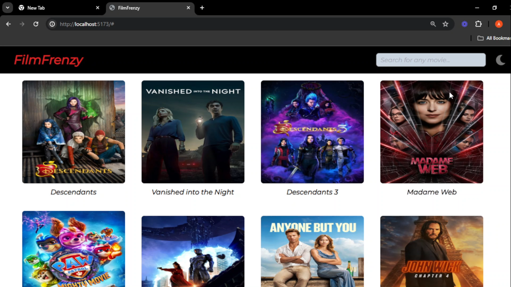
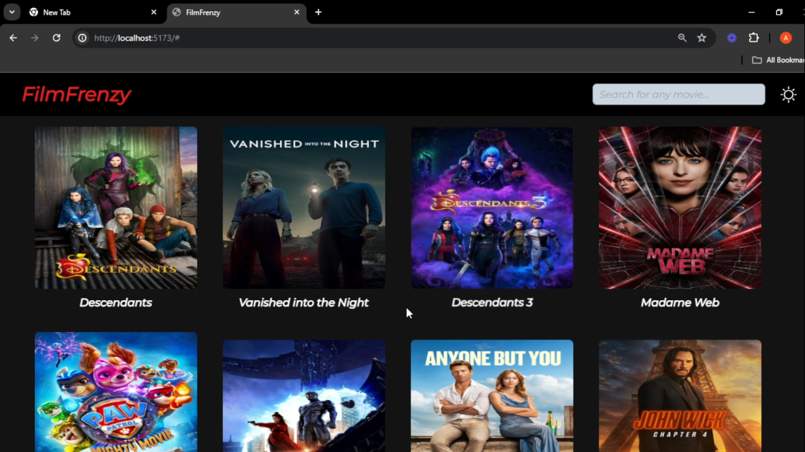

# FilmFrenzy

Welcome to FilmFrenzy! This project is a web application that allows users to search for any kind of movie, view details, and get recommendations. Built with ReactJS, TailwindCSS, and the MovieDB API, FilmFrenzy aims to provide a comprehensive and enjoyable movie browsing experience.

## Table of Contents

1. [Features](#features)
2. [Screenshots](#screenshots)
3. [Installation](#installation)
4. [Usage](#usage)
5. [Contributing](#contributing)
6. [License](#license)

## Features

- **Movie Search:** Search for movies by title, genre, or keywords.
- **Movie Details:** View detailed information about each movie, including cast, plot, and ratings.
- **Responsive Design:** Optimized for both desktop and mobile devices.
- **Mode: ** Light & Dark Mode

## Screenshots


### Light mode


### Dark mode


## Installation

To get a local copy up and running, follow these steps:

1. **Clone the repository:**

    ```bash
    git clone https://github.com/your-username/filmfrenzy.git
    ```

2. **Navigate to the project directory:**

    ```bash
    cd filmfrenzy
    ```

3. **Install dependencies:**

    ```bash
    npm install
    ```

4. **Get an API key from [The Movie Database (TMDb)](https://www.themoviedb.org/).**

5. **Create a `.env` file in the root directory and add your TMDb API key:**

    ```env
    REACT_APP_TMDB_API_KEY=your_api_key_here
    ```

6. **Start the development server:**

    ```bash
    npm start
    ```

## Usage

- **Search Movies:** Use the search bar on the home page to find movies by title, genre, or keywords.
- **View Details:** Click on a movie from the search results to view detailed information.
- **Get Recommendations:** Explore recommended movies based on your search and viewing history.

## Contributing

We welcome contributions to enhance the functionality and features of this project. To contribute:

1. Fork the repository.
2. Create a new branch:

    ```bash
    git checkout -b feature-branch
    ```

3. Make your changes and commit them:

    ```bash
    git commit -m 'Add some feature'
    ```

4. Push to the branch:

    ```bash
    git push origin feature-branch
    ```

5. Open a pull request.

## License

Distributed under the MIT License. See `LICENSE` for more information.
